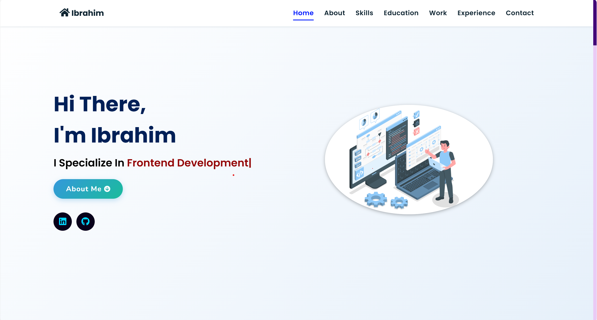

# 🚀 Portfolio Website

Personal portfolio website built using **HTML5**, **CSS3**, and **JavaScript** to showcase my skills, projects, and contact information.

🔗 **Live Demo:** [View Website][(https://ibrahim-b-portfolio.netlify.app/)]

## 📸 

## 📌 Tech Stack

---

## 🛠 Technologies Used

- **HTML5** – Semantic and structured content.
- **CSS3** – Flexbox, Grid, animations, and media queries.
- **JavaScript (Vanilla JS)** – DOM manipulation and interactivity.
- **EmailJS** – (demo-only) to showcase form integration.
- **Responsive Design** – Mobile-first layout.
- **Extras** – 
  - [Typed.js](https://github.com/mattboldt/typed.js)
  - [Vanilla Tilt.js](https://micku7zu.github.io/vanilla-tilt.js/)
  - [Scroll Reveal](https://scrollrevealjs.org/)
  - [Font Awesome](https://fontawesome.com/)
  - JSON for structured data

<h2>📬 Contact</h2>

Feel free to reach me through the below handles if you'd like to contact me.

